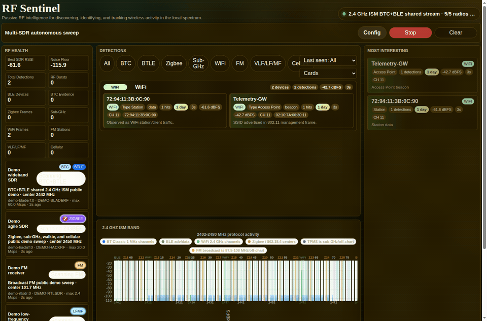
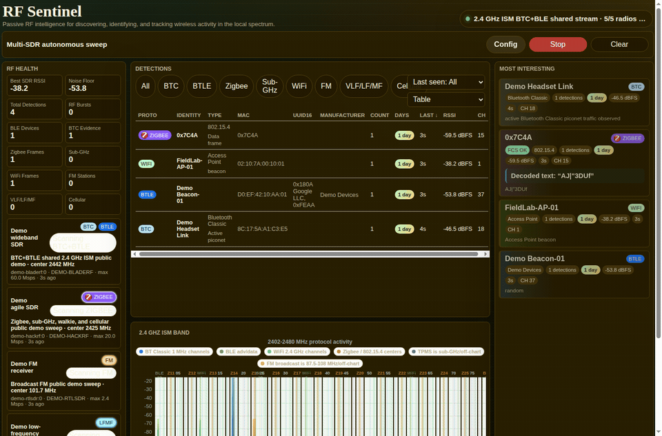
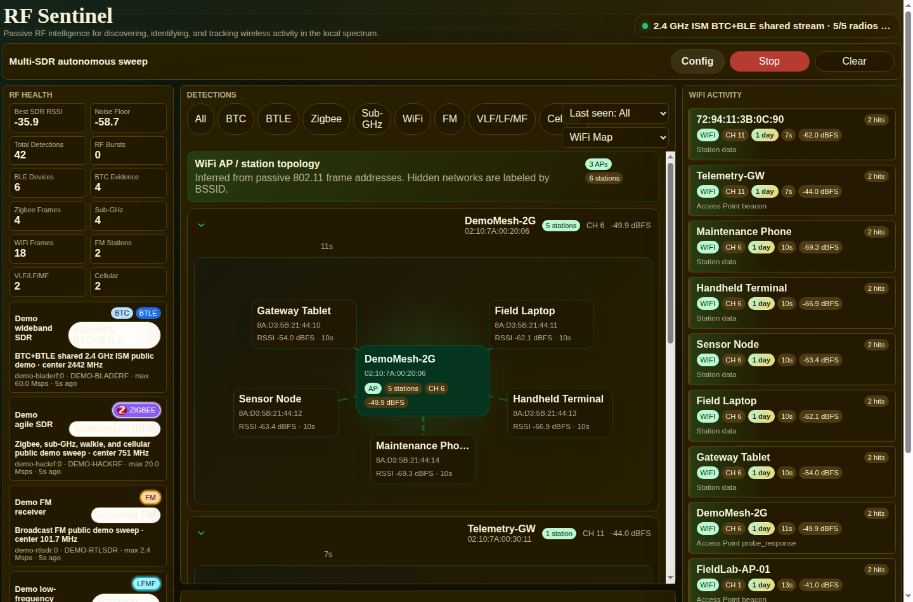
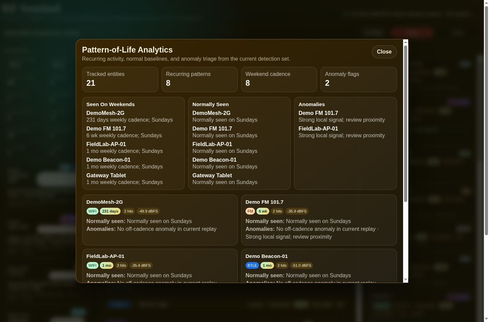

# RF Sentinel


RF Sentinel is a passive, multi-protocol RF intelligence platform for SDR-backed discovery, normalized event processing, entity tracking, dashboards, alerts, and reports.

The current app is the first live dashboard and capture front end. It uses `sdr-gateway` IQ streams for BLE and Bluetooth Classic discovery and hosts protocol plugins for additional RF families. The engineering focus is the platform layer: radio orchestration, event schemas, plugin boundaries, streaming capture, and operator-facing observability.

Related RTG Spectrum pages:

- [RF Sentinel module case study](https://rtgspectrum.com/rf-sentinel/)
- [RF Sentinel + Trace Analyzer case study](https://rtgspectrum.com/case-studies/rf-sentinel-trace-analyzer/)
- [RF signal classification software](https://rtgspectrum.com/services/rf-sensing/)

## Public Demo Mode

RF Sentinel now includes a hardware-free public demo that replays deterministic synthetic detection events into the normal dashboard. It shows Bluetooth Classic (`BTC`), BLE, Zigbee / 802.15.4, WiFi APs and stations, TPMS, walkie-style sub-GHz activity, FM broadcast, VLF/LF/MF, passive cellular awareness, and pattern-of-life analytics without requiring SDR hardware or committing real RF captures.

```bash
docker compose -f docker-compose.demo.yml up --build
```

Open `http://127.0.0.1:8080`. Use `RF_SENTINEL_DEMO_PORT=8081` if port 8080 is busy.

### What This Proves

- One-command Docker packaging for a live RF dashboard demo.
- A normalized event pipeline that can ingest multiple wireless protocol families.
- Entity tracking, detection counts, RF health metrics, WiFi AP/station topology, pattern-of-life cadence, and 2.4 GHz protocol activity visualization from replayed events.
- A modal analytics view for weekend recurrence, normal baselines, and anomaly triage.
- Public-safe demo data generated under `.demo/events/` and excluded from version control.

See [`docs/demo.md`](docs/demo.md) for the full demo workflow.

## Visual Evidence

| Public demo replay | Detection table population | WiFi AP / station topology |
|---|---|---|
| [](docs/media/rf-sentinel-public-demo.gif) | [](docs/media/rf-sentinel-public-demo-table.gif) | [](docs/media/rf-sentinel-public-demo-wifi-topology.png) |

| Pattern-of-life analytics |
|---|
| [](docs/media/rf-sentinel-public-demo-analytics.png) |

| Live multi-protocol scan | Protocol group settings |
|---|---|
| [](docs/media/rf-sentinel-full-scan.jpg) | [](docs/media/rf-sentinel-protocol-settings.jpg) |

| Bluetooth Classic scan configuration |
|---|
| [](docs/media/rf-sentinel-btc-config.jpg) |

## License

RF Sentinel itself is proprietary commercial software licensed under the
`RF Sentinel Commercial License`; see [`LICENSE`](LICENSE).

Some plugins are distributed under separate open-source licenses. In particular,
`rf_platform/plugins/bluetooth-classic` is a GPLv3 submodule based on
[`bsnet/btsniffer`](https://github.com/bsnet/btsniffer). See
[`THIRD_PARTY_NOTICES.md`](THIRD_PARTY_NOTICES.md).

Product sentence:

> A multi-protocol RF intelligence platform that passively discovers and tracks nearby wireless devices across Bluetooth, WiFi, TPMS, Zigbee/802.15.4, drone/UAS, and SDR-observed signals, with optional authorized test/effects modules for defense and lab environments.

The core product stays passive: RF discovery, protocol intelligence, entity resolution, pattern-of-life analytics, dashboards, alerts, and reports. Active replay/simulation/effects work belongs in a separate authorized lab module with explicit controls.

## Current Capabilities

- BLE advertising-channel scanning on channels 37, 38, and 39.
- BT Classic single-channel scanning across channels 0 through 78.
- Classic LAP extraction from the access code.
- UAP candidate brute forcing from the packet header using the HEC/whitening procedure from the included `research/btsniffer` code.
- Per-LAP candidate pruning across repeated packets using the 625 us slot clock relationship.
- LAP identity tracking that displays `UAP XXX` until the UAP candidate set resolves.
- Optional browser-controlled channel hopping with a configurable dwell time.
- 60 MHz BT Classic bank capture on bladeRF that splits the stream into Classic channel lanes and decodes them together.
- Separate BTC and BTLE SDR selection, so BTC can use `bladerf:0` while BTLE uses `hackrf:0`.
- A 79-channel Classic activity chart with one vertical bar per channel.
- Zigbee / IEEE 802.15.4 receiver plugin under `rf_platform/plugins/zigbee-802154`.
- Sub-GHz / TPMS receiver plugin under `rf_platform/plugins/subghz-stack`.
- Multi-protocol scanner CLI that runs BTC on one SDR while time-slicing BLE, Zigbee, and TPMS on another SDR.

## Project Layout

- `ui/backend/app.py`: Flask API, gateway stream control, BLE detector, BT Classic LAP/UAP tracker.
- `ui/frontend/index.html`: browser UI for SDR controls, RF health, discoveries, and UAP candidates.
- `rf_platform/`: shared normalized event and entity primitives for the broader platform.
- `rf_platform/plugins/bluetooth-classic/`: Bluetooth Classic sniffer plugin.
- `rf_platform/plugins/bluetooth-lowenergy/`: BLE advertising receiver plugin.
- `rf_platform/plugins/zigbee-802154/`: Zigbee / IEEE 802.15.4 receiver plugin.
- `rf_platform/plugins/subghz-stack/`: Sub-GHz / TPMS receiver plugin.
- `docs/`: product strategy, architecture, and milestone roadmap.
- `research/`: the referenced paper and corresponding `btsniffer` code.

## Platform Roadmap

The milestone plan lives in:

- `docs/product_strategy.md`
- `docs/architecture.md`
- `docs/milestones.md`

Near-term build order:

1. Normalize all observations into `rf_platform.RFEvent`.
2. Add a SQLite event store and replay/export mode.
3. Feed BLE and Bluetooth Classic detections into the event store.
4. Feed Zigbee / 802.15.4 plugin frames into the event store.
5. Add WiFi monitor-mode ingestion.
6. Add TPMS ingestion.
7. Build entity resolution and pattern-of-life dashboard views.

## Docker

A container build exists at `docker/` (own README, own soapy-build
assets), deployed on station1 and dev-desktop. **See `docker/README.md`**
for deploy commands (the actual `rfiq_daemon`-sharing production config,
not the older direct-`sdr-gateway` design) and a known gap: the UI's
device picker and "start scan" button still depend on `sdr-gateway`
being up, even though the shared passive BT/BLE detection view does not.

## Requirements

- Python 3.10+.
- For the shared passive detection view (BT/BLE cards): a running
  `rfiq_daemon` instance and the shared `bt-detector` sidecar - see
  `rf-iq-gateway` and `docker/README.md`'s "Known gap" section.
- For the UI's own device picker / "start scan" button specifically: a
  running `sdr-gateway` instance (`http://127.0.0.1:8080` default) - not
  currently running on either deployed host, so that particular UI path
  currently shows "no SDRs are available from sdr-gateway".

## Setup

```bash
cd rf-sentinel
./install.sh
```

`install.sh` creates/updates the Python venv and rebuilds the native Bluetooth
Classic sniffer plugin for the current machine architecture. This matters when
deploying between `x86_64` and `aarch64`; copied binaries are not portable.

At runtime, `ui/backend/app.py` also checks the Bluetooth Classic sniffer binary
before launch. If it is missing, stale, points at an old CMake source directory,
or has the wrong architecture, it will rebuild automatically unless
`BTC_SNIFFER_AUTO_BUILD=0` is set.

If `sdr-gateway` auth is enabled:

```bash
export SDR_GATEWAY_API_TOKEN="<your-token>"
```

Optional base URL override:

```bash
export SDR_GATEWAY_BASE_URL="http://127.0.0.1:8080"
```

## Run

```bash
cd rf-sentinel
source .venv/bin/activate
python3 ui/backend/app.py
```

Open:

- `http://127.0.0.1:5050`

The UI defaults to BTC enabled. For combined scanning, enable both `BTC` and `BTLE`; BTC defaults to a bladeRF device at `60` MHz and BTLE defaults to a HackRF device. The single gain slider drives both LNA and VGA gain values. Set the dwell seconds and press the Start/Stop button to rotate BTC banks while BTLE cycles advertising channels 37/38/39.

Run the multi-protocol CLI scanner:

```bash
rf_sentinel_scan
```

Default scanner layout:

- `bladerf:0` runs Bluetooth Classic continuously at `2442 MHz` / `60 MHz`.
- `hackrf:0` time-slices BLE, Zigbee/802.15.4, and TPMS.
- BLE uses the gateway-managed HackRF IQ sweep.
- Zigbee defaults to the known-good XBee channel 25 settings.
- TPMS auto-hops known `315 MHz` and `433.92 MHz` bands.

Example with explicit radios and shorter slices:

```bash
rf_sentinel_scan \
  --btc-device-id bladerf:0 \
  --hop-device-id hackrf:0 \
  --ble-slice-s 15 \
  --zigbee-slice-s 15 \
  --tpms-slice-s 15
```

## Notes

- The BT Classic implementation is based on `research/btsniffer/full-band/sources/frame-processing/btdecoder.cpp`.
- The paper's strongest setup captures many channels concurrently. This app uses one `sdr-gateway` stream at a time, so Classic resolution depends heavily on catching repeated packets for the same LAP on the tuned channel.
- A resolved UAP still gives `NAP:UAP:LAP` only as `??:UAP:LAP`; discovering the NAP requires additional protocol evidence beyond this header brute-force step.
